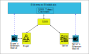

# Getting Started: An Example XBR Application

This getting started will take you through a simple, complete XBR application, structured in microservices.

This is to allow you to see the interactions across the entire system , including connecting to Web frontends. Since XBR is uses Crossbar.io and the Web Application Messaging Protocol (WAMP), this will also give you insight into a WAMP application.

You can take this as a template for your own applications.

## Introduction

XBR  is a platform  to monetize the data using block chain based technology. It is a decentralized, secure, API-based real-time platform for data sharing and monetizing between particpants. XBR works  on top of the Ethereum Blockchain and Below is the top level architecure of the platform.

* The XBR network consist of  **on-chain** and **off-chain** components.
* The On-chain component consist of XBR smart contracts which reside in the Ethereum  blockchain network which are represented by the blue colored regions.
* The Off-chain component builds up the XBR network infrastructure and they are represented by the yellow colored regions.
* There are three types of participating software components in the XBR network(off-chain): Buyer Delegates, Seller Delegates, XBR Market Operator
* For the buyer and the seller delegates XBR acts as a gateway to the Ethereum blockchain.
* To participate in the XBR network, the participant has to register with the XBR network.

### Ethereum Wallet

Since XBR is working top of the Ethereum blockchain, each participant needs to have an Ethereum address in order to register with XBR network. For this example you require only Buyer and Seller Delegates  and the rest of the on-chain and off-chain infrastructure is available for you to use.

There is a run-through with documentation for [creating a wallet](./CreateWallet.md)

This will provide you with two ethereum addresses and their corresponding private keys.

# Odometer Example

In our simple application, data generated by a car's odometer is sold, and the buyer uses this data to display a current "eco-balance" of distance driven vs. a yearly kilometer allowance.

 

The above flow diagram explains how the data is flowing from the odometer of the car to the seller, is bought by the buyer and stored in the display backend and finally displayed in a web browser.

Each component here is a seperate microservice. We will be running all the components except for the XBR which is already up and running at the URL wss://continental2.crossbario.com/ws.

Let's see each component and what role it plays.

1. The **Odometer**  component simulates the odometer of a car and publishes the kilometers covered to the topic **io.myapp.odometer**. This program does not use any XBR functionality, it uses the XBR instance as a WAMP router to publish its data.
2. The **Seller** component is registered to the XBR network as a seller of a service. It receives the data from the topic **io.myapp.odometer** and sells it in XBR for a particular price at the topic **io.crossbar.example**.
3. The **Buyer** component is registered to the XBR network as a buyer. It buys the data from the topic **io.crossbar.example** and publishes it locally to the topic  **io.myapp.cardata**
4. The **Display Backend** subscribes to the topic **io.myapp.cardata** and stores the last received data. It simultaneusly and offers an RPC service "io.myapp.get_distance" and delivers the stored data.
5. The **Display** component is a browser which displays the result. It fetches the odometer reading from the **display-backend** and shows the progress.

All the components examples are available as both Python and Javascript programs which exception of the display component which is a HTML/JS program. You can choose any of them (or mix components since both WAMP and XBR are language agnostic) to start.
* [Odometer example using Python](./OdometerPython.md)
* [Odometer example using NodeJS](./OdometerNodeJS.md)

