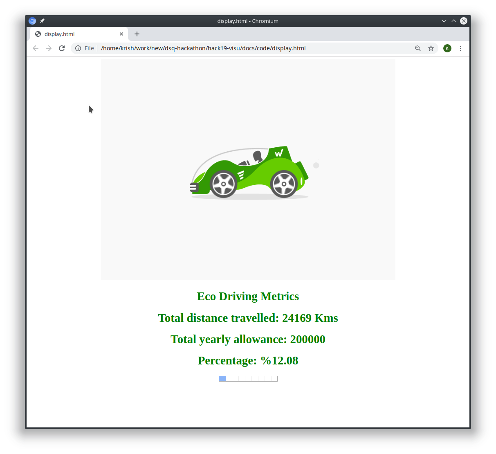

# Odometer Example using NodeJS
To start running the example code we need to install the Node JS. Follow the link to [install NoedJS](./InstallNodeJS.md). 
## Fetching the code 
Where to get the source from?
## Installing dependencies
```
$ cd dsq-hackathon/hack19-visu/docs/code/
$ npm install
```

Note: Remember the package.json which resides in dsq-hackathon/hack19-visu/docs/code/ expects the autobahn-js to be on the same folder level as dsq-hackathon
## Odometer component
The application reads the Crossbario URL from the environment variable **XBR_INSTANCE** and starts publishing the odometer count and the current time to the topic `xbr.myapp.odometer`

### Odometer.js
```js
// Example WAMP client for AutobahnJS connecting to a Crossbar.io WAMP router.

// AutobahnJS, the WAMP client library to connect and talk to Crossbar.io:
let autobahn = require("autobahn");

console.log("Running AutobahnJS " + autobahn.version);

// We read the connection parameters from the command line in this example:
const url = process.env.XBR_INSTANCE || "ws://localhost:8080/ws";
const realm = process.env.XBR_REALM || "realm1";

// Make us a new connection ..
let connection = new autobahn.Connection({url: url, realm: realm});
let counter = 20000;
// .. and fire this code when we got a session
connection.onopen = function (session, details) {
  console.log("session open!", details);

  setInterval(function () {
    console.log("publishing to xbr.myapp.odometer");
    counter += Math.floor(Math.random() * 10);
    let date = new Date().toISOString();
    session.publish("xbr.myapp.odometer", [counter + " " + date]);
  }, 1000);
};

// .. and fire this code when our session has gone
connection.onclose = function (reason, details) {
  console.log("session closed: " + reason, details);
};

// Don"t forget to actually trigger the opening of the connection!
connection.open();
```

### Explanation
The above code is a simple data publisher. When the application is started it reads the environmental variable XBR_INSTANCE and XBR_REALM (if defined other takes the hardcoded value). Then it joins the XBR instance.
Upon joining the client publishes the **counter**  to the topic **xbr.myapp.odometer**. The counter increments randomly between 1 to 10 every iteration.  Along with the odometer the date and time is also published for future usage.

### Run in  Console Window 1
```bash
$ export XBR_INSTANCE="wss://continental2.crossbario.com/ws"
$ export XBR_REALM="realm1"

$ node odometer.js 
Running AutobahnJS 19.9.1
session open! { x_cb_node_id: null,
  realm: 'realm1',
  authid: 'WJ43-MC4T-XFRX-CV5H-N5AJ-E9CE',
  authrole: 'anonymous',
  authmethod: 'anonymous',
  authprovider: 'static',
  authextra:
   { x_cb_node_id: null,
     x_cb_peer: 'tcp4:95.90.216.210:62706',
     x_cb_pid: 26247 },
  roles:
   { broker: { features: [Object] },
     dealer: { features: [Object] } },
  transport:
   { type: 'websocket',
     url: 'wss://continental2.crossbario.com/ws',
     protocol: 'wamp.2.json' } }
publishing to xbr.myapp.odometer
publishing to xbr.myapp.odometer
publishing to xbr.myapp.odometer
```

## Seller component
In order to sell in the XBR network  you need to  get the  following  informations.

* Your  Ethereum Seller account private key.
* Address of the Market Maker in Ethereum.
* XBR Network Instance URL
* Your data to be sold, in this case odometer data, Price  etc.

Now lets get started  by running a Simple Seller example , Our Simple seller example  is going to sell the Odometer data of a car.
The seller  application which  will  subscribe and receive the odometer  data from the topic and sell it in XBR market.

### seller.js
```js
let autobahn = require('autobahn');
let xbr = require('autobahn-xbr');

console.log('Running on Autobahn ' + autobahn.version);
console.log('Running Autobahn-XBR ' + xbr.version);

const url = process.env.XBR_INSTANCE || "ws://localhost:8080/ws";
const realm = process.env.XBR_REALM || "realm1";
const seller_privkey = process.env.XBR_SELLER_PRIVKEY;
const marketmaker_addr = process.env.XBR_MARKET_MAKER_ADR;


// WAMP connection
let connection = new autobahn.Connection({
  realm: realm,
  transports: [
    {
      url: url,
      type: 'websocket',
      serializers: [ new autobahn.serializer.CBORSerializer() ],
    }
  ]
});


// callback fired upon new WAMP session
connection.onopen = function (session, details) {

  console.log("WAMP session connected:", details);


  // the XBR token has 18 decimals
  const decimals = new xbr.BN('1000000000000000000');

  // price in XBR per key
  const price = new xbr.BN(35).mul(decimals);

  // key rotation interval in seconds
  const key_rotation_interval = 10;

  // API ID of the interface of the offered service
  const api_id = xbr.uuid('bd65e220-aef7-43c0-a801-f8d95fa71f39');

  // instantiate a simple seller
  let seller = new xbr.SimpleSeller(marketmaker_addr, seller_privkey);
  let counter = 1;

  seller.add(api_id, 'io.crossbar.example', price, key_rotation_interval);


  let do_publish = function(counter) {
    const payload = {"data": "js-node-seller", "counter": counter};

    // encrypt the XBR payload, potentially automatically rotating & offering a new data encryption key
    let [key_id, enc_ser, ciphertext] = seller.wrap(api_id, 'io.crossbar.example', payload);

    const options = {acknowledge: true};

    session.publish("io.crossbar.example",
        [key_id, enc_ser, ciphertext],
        {},
        options).then(
        function (pub) {
          console.log("Published event " + pub.id);
        },
        function (err) {
          console.log("Failed to publish event", err);
        }
    );

  };
  function on_cardata (args) {
    data = args[0];
    do_publish(data);
    console.log("on_counter() event received with counter " + data);
  }

  session.subscribe('xbr.myapp.odometer', on_cardata).then(
      function (sub) {
        console.log(' xbr.myapp.odometer subscribed to topic');

      },
      function (err) {
        console.log('xbr.myapp.cardata failed to subscribe to topic', err);
      }
  );
  // start selling
  seller.start(session).then(
      // success: we've got an active paying channel with remaining balance ..
      function (balance) {
        console.log("Seller has started, remaining balance in active paying channel is " + balance.div(decimals) + " XBR");
        do_publish();
      },
      // we don't have an active paying channel => bail out
      function (error) {
        console.log("Failed to start seller:", error);
        process.exit(1);
      }
  );
};


// open WAMP session
connection.open();
```

### Explanation
The application  reads the following  variable  XBR_INSTANCE, XBR_REALM,XBR_MARKET_MAKER_ADR and XBR_SELLER_PRIVKEY from environmental if not then uses the hardcode values. Upon joining the URL provided by the **XBR_INSTANCE** , the application creates a seller with the line

```js
    var seller = new xbr.SimpleSeller(marketmaker_addr, seller_privkey);
```

This seller object is created for the market with an address defined by the **XBR_MARKET_MAKER_ADR**. At this point we have defined a seller but not what to be sold . The below line defines it.

```js
    seller.add(api_id, 'io.crossbar.example', price, key_rotation_interval);
```

 Here the first parameter is the api_id which is a 16 digit key using which the encryption keys will be generated for encrypting data in a rotation basis. The next is the topic to which the data will be published. The price parameter is price in XBR token per encryption key generated on rotation. The key_rotation_interval (in seconds) in which to auto-rotate the encryption key.
  
 ```js
        let [key_id, enc_ser, ciphertext] = seller.wrap(api_id, 'io.crossbar.example', payload);
```
The above line encrypts the payload and stores it in ciphertext and later publishes it.

### Run in  Console Window 2
```
export XBR_REALM="realm1"
$ export XBR_INSTANCE="wss://continental2.crossbario.com/ws"
$ export XBR_SELLER_PRIVKEY=0xadd53f9a7e588d003326d1cbf9e4a43c061aadd9bc938c843a79e7b4fd2ad743

$ node seller.js 
```

## Buyer component
In order to sell in the XBR network  you need to  get the  following  informations.

* Your  Ethereum Buyer account private key.
* Address of the Market Maker in Ethereum.
* XBR Network Instance URL

Now lets get started  by running a Simple Buyer example , Our Simple seller example  is going to sell the Odometer data of a car.
The seller  application which  will  subscribe and receive the odometer  data from the topic and sell it in XBR market.
## buyer.js
```js
var autobahn = require('autobahn');
var xbr = require('autobahn-xbr');

console.log('Running on Autobahn ' + autobahn.version);
console.log('Running Autobahn-XBR ' + xbr.version);
const url = process.env.XBR_INSTANCE || "ws://localhost:8080/ws";
const realm = process.env.XBR_REALM || "realm1";
const buyer_privkey = process.env.XBR_BUYER_PRIVKEY;
const marketmaker_addr = process.env.XBR_MARKET_MAKER_ADR;

// WAMP connection
var connection = new autobahn.Connection({
    realm: realm,
    transports: [
        {
            url: url, 
            type: 'websocket',
            serializers: [ new autobahn.serializer.CBORSerializer() ],
        }
    ]
});

// callback fired upon new WAMP session
connection.onopen = function (session, details) {

    console.log("WAMP session connected:", details);

    // the XBR token has 18 decimals
    const decimals = new xbr.BN('1000000000000000000');

    // maximum price we are willing to pay per (single) key: 100 XBR
    const max_price = new xbr.BN('100').mul(decimals);

    // instantiate a simple buyer
    var buyer = new xbr.SimpleBuyer(marketmaker_addr, buyer_privkey, max_price);

    // start buying ..
    buyer.start(session).then(
        // success: we've got an active payment channel with remaining balance ..
        function (balance) {
            console.log("Buyer has started, remaining balance in active payment channel is " + balance.div(decimals) + " XBR");

            session.subscribe("io.crossbar.example", function (args, kwargs, details) {
                let [key_id, enc_ser, ciphertext] = args;

                // decrypt the XBR payload, potentially automatically buying a new data encryption key
                buyer.unwrap(key_id, enc_ser, ciphertext).then(
                    function (payload) {
                        console.log("Received event " + details.publication, payload);
                        session.publish('xbr.myapp.cardata', [payload['counter']]);
                    },
                    function (failure) {
                        console.log(failure);
                        process.exit(1);
                    }
                )
            });

        },
        // we don't have an active payment channel => bail out
        function (error) {
            console.log("Failed to start buyer:", error);
            process.exit(1);
        }
    );
};


// open WAMP session
connection.open();
```
### Explanation
Similar to the seller component, the buyer component reads thefollowing variable XBR_INSTANCE, XBR_REALM,XBR_MARKET_MAKER_ADR and XBR_BUYER_PRIVKEY from environment. When the client connects to the XBR instance, then the **joined** method is called up. 

```js
    var buyer = new xbr.SimpleBuyer(marketmaker_addr, buyer_privkey, max_price);
```
In the above line a simple buyer object is created by passing the market maker address, private key and the max price. Here the max price is the price we are willing to buy per key.
```js
buyer.start(session)
```
After creating the buyer, we can start buying the keys using the **start** method. 
```js
   payload = await buyer.unwrap(key_id, enc_ser, ciphertext)
```
Whenever the event ( encrypted data) arrives, The **unwrap** method decrypts the data using the key that is purchased from the seller.
```
session.publish('xbr.myapp.cardata', [payload]);
```
After decrypting the data, the payload is published to the topic **io.myapp.cardata** which will eventually be handled by the display-backend component.
### Run in  Console Window 3
```
$ export XBR_BUYER_PRIVKEY=0x395df67f0c2d2d9fe1ad08d1bc8b6627011959b79c53d7dd6a3536a33ab8a4fd
$ export XBR_REALM="realm1"
$ export XBR_INSTANCE="wss://continental2.crossbario.com/ws"
$ export XBR_MARKET_MAKER_ADR=0x3E5e9111Ae8eB78Fe1CC3bb8915d5D461F3Ef9A9

$ node buyer.js 

```

## Display Backend component
The display backend component subscribes to the topic **xbr.myapp.cardata** and stores the received data and provides the RPC service **xbr.myapp.get_distance** .
## Display-backend.js
```js
// Example WAMP client for AutobahnJS connecting to a Crossbar.io WAMP router.

// AutobahnJS, the WAMP client library to connect and talk to Crossbar.io:
let autobahn = require('autobahn');

console.log("Running AutobahnJS " + autobahn.version);

// We read the connection parameters from the command line in this example:
const url = process.env.XBR_INSTANCE || "ws://localhost:8080/ws";
const realm = process.env.XBR_REALM || "realm1";

// Make us a new connection ..
let connection = new autobahn.Connection({url: url, realm: realm});
// .. and fire this code when we got a session
connection.onopen = function (session, details) {
  console.log("session open!, realm=", details.realm);
  let data = null;

  function get_distance(args) {
    return data;
  }

  session.register('xbr.myapp.get_distance', get_distance).then(
      function (reg) {
        console.log('procedure registered', reg.procedure);
      },
      function (err) {
        console.log('xbr.myapp.get_distance failed to register procedure', err);
      }
  );

  function on_cardata(args) {
    data = args[0];
    console.log("on_counter() event received with counter " + data);
  }

  session.subscribe('xbr.myapp.cardata', on_cardata).then(
      function (sub) {
        console.log('subscribed to topic', sub.topic);
      },
      function (err) {
        console.log('xbr.myapp.cardata failed to subscribe to topic', err);
      }
  );
};

// .. and fire this code when our session has gone
connection.onclose = function (reason, details) {
  console.log("session closed: " + reason, details);
};

// Don't forget to actually trigger the opening of the connection!
connection.open();
```
### Run in  Console window 4
```
export XBR_INSTANCE="wss://continental2.crossbario.com/ws"
krish@codelectron:~/work/version2/dsq-hackathon/hack19-visu/docs/code$ export XBR_REALM="realm1"
krish@codelectron:~/work/version2/dsq-hackathon/hack19-visu/docs/code$ node display-backend.js 
Running AutobahnJS 19.9.2
session open! { x_cb_node_id: null,
  realm: 'realm1',
  authid: 'F4PY-9NJ5-R4Y9-FALA-ULYX-7CYX',
  authrole: 'anonymous',
  authmethod: 'anonymous',
  authprovider: 'static',
  authextra:
   { x_cb_node_id: null,
     x_cb_peer: 'tcp4:110.38.10.20:33850',
     x_cb_pid: 28945 },
  roles:
   { broker: { features: [Object] },
     dealer: { features: [Object] } },
  transport:
   { type: 'websocket',
     url: 'wss://continental2.crossbario.com/ws',
     protocol: 'wamp.2.json' } }
procedure registered xbr.myapp.get_distance
subscribed to topic xbr.myapp.cardata
```

## Display component
The display component is a wamp client running in browser. It calls the RPC service io.myapp.get_distance and get the current reading which is stored in the display-backend component. The RPC call is made every second and the HTML page is updated with the latest data.
## display.html
```
<!DOCTYPE html>
<html>
   <body>
      

      <h1 style="color:green;" >Eco Driving Metrics </h1>
      <h1 id="id_distance" style="color:green;" >Total distance travelled</h1>      
      <h1 style="color:green;" >Total yearly allowance: 200000</h1>
      <h1 id="id_percentage" style="color:green;" >Percentage</h1>      
      <progress id="progressbar"  value="5" max="100">70 %</progress>
      <script src="autobahn.min.js"></script>
      <script src="display.js"></script>
   </body>
</html>
```
## display.js
```
var isBrowser = false;
try {
    var autobahn = require('autobahn');
} catch (e) {
    // when running in browser, AutobahnJS will
    // be included without a module system
    isBrowser = true;
}
console.log("Running AutobahnJS " + autobahn.version);

if (isBrowser) {
    url = 'wss://continental2.crossbario.com/ws';
    realm = 'realm1';
}
else {
    url = process.env.XBR_INSTANCE;
    realm = process.env.XBR_REALM;
}
var connection = new autobahn.Connection({ url: url, realm: realm });
console.log("Running AutobahnJS " + url+ "  "+realm);

connection.onopen = function (session, details) {
    console.log("session open!", details);
    setInterval(function () {
    session.call("io.myapp.get_distance",[]).then(
    function(res) {
    var array = res.split(" ");
    distance = array[0]
    percentage = ((distance)/200000)*100;
    percentage = percentage.toFixed(2);
    document.getElementById('progressbar').value = percentage;
    document.getElementById('id_distance').innerHTML = "Total distance travelled: "+distance+" Kms";
    document.getElementById('id_percentage').innerHTML = "Percentage: %"+percentage;    
    console.log('Distance is', distance);
    console.log('Percentage is', percentage);
    }, session.log);
   }, 1000);
};

connection.onclose = function (reason, details) {
    console.log("session closed: " + reason, details);
}
connection.open();

```
Output:



