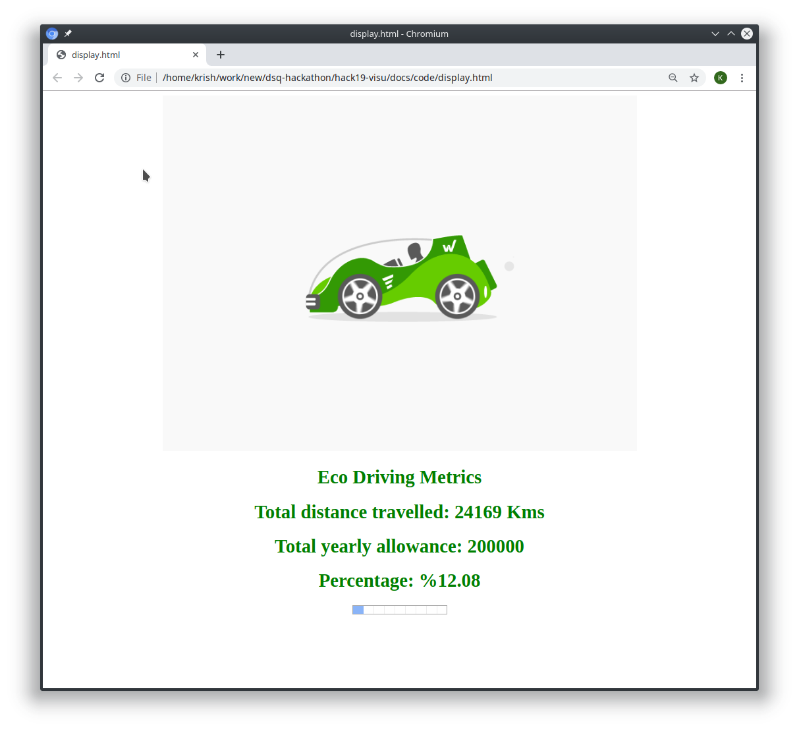

# Odometer Example using Python
To start running the example code we need to install the python version 3.7.2 or above. Follow the link to [install Python](./InstallPython.md). After installing the Python, for running each component you need to use the [Python virtual environment](./PythonVirtualenv.md).

## Fetching the code 
Where to get the source from?
## Installing dependencies
```bash
((vpy_3.7.2) )$ cd xbr-examples/getting-started
((vpy_3.7.2) )$ pip install -r requirements.txt
```
## Odometer component
The application reads the Crossbario URL from the environment variable **XBR_INSTANCE** and starts publishing the odometer count and the current time to the topic `xbr.myapp.odometer`
### odometer.py
```python
import datetime
import os
import random

from autobahn.twisted.component import Component, run
import txaio


odometer_component = Component(
    transports=os.environ.get('XBR_INSTANCE', u'ws://localhost:8080/ws'),
    realm=os.environ.get('XBR_REALM', u'realm1')
)


@odometer_component.on_join
async def joined(session, _details):
    print("session joined...")
    counter = 20000
    while session.is_attached():
        date = datetime.datetime.now()
        print('Odometer Simulator publishing xbr.myapp.odometer', counter, date)
        session.publish(u'xbr.myapp.odometer', f'{counter} {date}')
        counter += random.randint(1, 10)
        await txaio.sleep(1)


if __name__ == '__main__':
    run([odometer_component])
```

### Explanation
The above code is a simple data publisher. When the application is started it reads the environmental variable XBR_INSTANCE and XBR_REALM (if defined otherwise takes the hardcoded value). Then it joins the Crossbar.io instance in the line 
```python
   run([odometer_component])
```
When this client joins the Crossbar instance  **async def joined(session, _details):** function gets called. Upon joining, the client publishes the **counter**  to the topic **io.myapp.odometer**. The counter increments randomly between 1 to 10 every iteration.  Along with the odometer the date and time is also published for future usage.


### Run in Console window 1
you need to use the [Python virtual environment](./PythonVirtualenv.md) .
```bash
((vpy_3.7.2) )$ cd xbr-examples/getting-started
((vpy_3.7.2) )$ export XBR_INSTANCE="wss://continental2.crossbario.com/ws"
((vpy_3.7.2) )$ python odometer.py
2019-09-15T16:06:50+0500 session joined...
2019-09-15T16:06:50+0500 Odometer Simulator publishing xbr.myapp.odometer 20000 2019-09-15 16:06:50.537597
2019-09-15T16:06:51+0500 Odometer Simulator publishing xbr.myapp.odometer 20007 2019-09-15 16:06:51.538993
2019-09-15T16:06:52+0500 Odometer Simulator publishing xbr.myapp.odometer 20016 2019-09-15 16:06:52.541547
2019-09-15T16:06:53+0500 Odometer Simulator publishing xbr.myapp.odometer 20021 2019-09-15 16:06:53.543893
```

## Seller component
In order to sell in the XBR network you need to get the following information.

* Your Ethereum Seller account private key.
* Address of the Market Maker in Ethereum.
* XBR Network Instance URL
* Your data to be sold, in this case odometer data, Price  etc.

Now lets get started by running a Simple Seller example, Our Simple seller example is going to sell the Odometer data of a car. The seller application which will subscribe and receive the odometer data from the topic and sell it in XBR market.

### seller.py
```python
import binascii
import os
from uuid import UUID

from autobahn.twisted.wamp import ApplicationSession, ApplicationRunner
from autobahn.wamp.types import PublishOptions
from autobahn.twisted.xbr import SimpleSeller


class SellerSession(ApplicationSession):
    async def onJoin(self, details):
        print('Seller session joined', details)

        market_maker_adr = binascii.a2b_hex(self.config.extra['market_maker_adr'][2:])
        print('Using market maker adr:', self.config.extra['market_maker_adr'])
        seller_privkey = binascii.a2b_hex(self.config.extra['seller_privkey'][2:])

        api_id = UUID('627f1b5c-58c2-43b1-8422-a34f7d3f5a04').bytes
        topic = 'io.crossbar.example'

        seller = SimpleSeller(market_maker_adr, seller_privkey)
        # 1 XBR
        price = 1 * 10 ** 18
        interval = 12
        seller.add(api_id, topic, price, interval, None)

        balance = await seller.start(self)
        balance = int(balance / 10 ** 18)
        print("Remaining balance: {} XBR".format(balance))

        async def on_odometer_data(count):
            print("event received: {}".format(count))
            payload = {'data': 'py-seller', 'counter': count}
            key_id, enc_ser, ciphertext = await seller.wrap(api_id, topic, payload)
            pub = await self.publish(topic, key_id, enc_ser, ciphertext,
                                     options=PublishOptions(acknowledge=True))

            print('Published event {}: {}'.format(pub.id, payload))

        try:
            await self.subscribe(on_odometer_data, "xbr.myapp.odometer")
            print("subscribed to topic '{}'".format("xbr.myapp.odometer"))
        except Exception as e:
            print("could not subscribe to topic: {}".format(e))


if __name__ == '__main__':
    url = os.environ.get('XBR_INSTANCE', u'ws://localhost:8080/ws')
    realm = os.environ.get('XBR_REALM', u'realm1')
    extra = {
        'market_maker_adr': os.environ.get('XBR_MARKET_MAKER_ADR', '0x3e5e9111ae8eb78fe1cc3bb8915d5d461f3ef9a9'),
        'seller_privkey': os.environ.get('XBR_SELLER_PRIVKEY',
                                         '0xadd53f9a7e588d003326d1cbf9e4a43c061aadd9bc938c843a79e7b4fd2ad743'),
    }

    runner = ApplicationRunner(url=url, realm=realm, extra=extra)
    runner.run(SellerSession, auto_reconnect=True)
```
### Explanation
The application reads the following variables XBR_INSTANCE, XBR_REALM, XBR_MARKET_MAKER_ADR and XBR_SELLER_PRIVKEY from environment, if they are not available then it uses the hardcode values. Upon joining the URL provided by the **XBR_INSTANCE** , the application creates a seller with the following line

```python
seller = SimpleSeller(market_maker_adr, seller_privkey)
```

This seller object is created for the market with an address defined by the **XBR_MARKET_MAKER_ADR**. At this point we have defined a seller but not what to be sold . The below line defines it.

```python
seller.add(api_id, topic, price, interval, None)

```

 Here the first parameter is the api_id which is a 16 digit key using which the encryption keys will be generated for encrypting data in a rotation basis. The topic is the topic to which the data will be published. The price parameter is price in XBR token per encryption key generated on rotation. The Interval (in seconds) in which to auto-rotate the encryption key.
  
```python
key_id, enc_ser, ciphertext = await seller.wrap(api_id, topic, payload)
```

The above line encrypts the payload and stores it in ciphertext and later publishes it.

### Run in  Console Window 2
you need to use the [Python virtual environment](./PythonVirtualenv.md) .

```
(vpy_3.7.2)$ export XBR_MARKET_MAKER_ADR=0x3E5e9111Ae8eB78Fe1CC3bb8915d5D461F3Ef9A9
(vpy_3.7.2)$ export XBR_SELLER_PRIVKEY=0xadd53f9a7e588d003326d1cbf9e4a43c061aadd9bc938c843a79e7b4fd2ad743
(vpy_3.7.2)$ export XBR_INSTANCE="wss://continental2.crossbario.com/ws"

(vpy_3.7.2)$ python seller.py 
WARNING: The XBR smart contracts are not yet deployed to public networks. Please set XBR_DEBUG_TOKEN_ADDR manually.
WARNING: The XBR smart contracts are not yet deployed to public networks. Please set XBR_DEBUG_NETWORK_ADDR manually.
2019-09-08T10:05:32+0200 connecting once using transport type "websocket" over endpoint "tcp"
2019-09-08T10:05:32+0200 Starting factory <autobahn.twisted.websocket.WampWebSocketClientFactory object at 0x7f6a4672d4a8>
2019-09-08T10:05:32+0200 Seller session joined SessionDetails(realm=<realm1>, session=7089118486069206, authid=<7A7K-9PN9-GT96-QP7U-EGLT-9ALR>, authrole=<anonymous>, authmethod=anonymous, authprovider=static, authextra={'x_cb_node_id': None, 'x_cb_peer': 'tcp4:95.90.216.210:62644', 'x_cb_pid': 26247}, resumed=None, resumable=None, resume_token=None)
2019-09-08T10:05:32+0200 Using market maker adr: 0x3E5e9111Ae8eB78Fe1CC3bb8915d5D461F3Ef9A9
2019-09-08T10:05:32+0200 Start selling from seller delegate address 0x0xd03ea8624C8C5987235048901fB614fDcA89b117 (public key 0x925b36d9c2b031d0f6c2..)
2019-09-08T10:05:32+0200 Starting key rotation every 12 seconds for api_id="627f1b5c-58c2-43b1-8422-a34f7d3f5a04" ..
2019-09-08T10:05:32+0200 XBR ROTATE key "f06d1b82-58e9-b77f-e2d7-cf0f7ad9ee0d" rotated [api_id="627f1b5c-58c2-43b1-8422-a34f7d3f5a04"]
2019-09-08T10:05:32+0200 XBR OFFER  key "f06d1b82-58e9-b77f-e2d7-cf0f7ad9ee0d" offered for 35 XBR [api_id=627f1b5c-58c2-43b1-8422-a34f7d3f5a04, prefix="io.crossbar.example", delegate="d03ea8624c8c5987235048901fb614fdca89b117"]
2019-09-08T10:05:32+0200 Delegate has currently active paying channel address 0x69dfd815b9610ef599471e8a70518785e199c7b5
2019-09-08T10:05:32+0200 Remaining balance: 300 XBR
2019-09-08T10:05:32+0200 subscribed to topic
2019-09-08T10:05:33+0200 event received: {0} 20100 2019-09-08 10:05:32.974228
2019-09-08T10:05:33+0200 Published event 8947033887553696: {'data': 'py-seller', 'counter': '20100 2019-09-08 10:05:32.974228'}
2019-09-08T10:05:34+0200 event received: {0} 20102 2019-09-08 10:05:33.978541
2019-09-08T10:05:34+0200 Published event 1869247557555522: {'data': 'py-seller', 'counter': '20102 2019-09-08 10:05:33.978541'}
2019-09-08T10:05:35+0200 event received: {0} 20103 2019-09-08 10:05:34.981712
2019-09-08T10:05:35+0200 Published event 2732272641872832: {'data': 'py-seller', 'counter': '20103 2019-09-08 10:05:34.981712'}
```

## Buyer component
In order to sell in the XBR network  you need to  get the  following  informations.

* Your  Ethereum Buyer account private key.
* Address of the Market Maker in Ethereum.
* XBR Network Instance URL

Now lets get started  by running a  Buyer example , Our  buyer example  is going to buy the Odometer data of a car.
The buyer application which  will  subscribe to the topic **io.crossbar.example** and receive the odometer  data from the topic and decrypt the data using the key provided by the seller and publish the raw data to the topic **io.myapp.cardata**.
## buyer.py
```python
import binascii
import os

from autobahn.wamp.types import SubscribeOptions
from autobahn.twisted.component import Component, run
from autobahn.twisted.xbr import SimpleBuyer


extra = {
    'market_maker_adr': os.environ.get('XBR_MARKET_MAKER_ADR', '0x3e5e9111ae8eb78fe1cc3bb8915d5d461f3ef9a9'),
    'seller_privkey': os.environ.get('XBR_BUYER_PRIVKEY',
                                     '0x395df67f0c2d2d9fe1ad08d1bc8b6627011959b79c53d7dd6a3536a33ab8a4fd'),
}
buyer_component = Component(
    transports=os.environ.get('XBR_INSTANCE', u'ws://localhost:8080/ws'),
    realm=os.environ.get('XBR_REALM', u'realm1'),
    extra=extra
)


@buyer_component.on_join
async def joined(session, details):
    print('Buyer session joined', details)

    market_maker_adr = binascii.a2b_hex(session.config.extra['market_maker_adr'][2:])
    print('Using market maker adr:', session.config.extra['market_maker_adr'])
    buyer_privkey = binascii.a2b_hex(session.config.extra['buyer_privkey'][2:])

    # 100 XBR
    max_price = 100 * 10 ** 18
    buyer = SimpleBuyer(market_maker_adr, buyer_privkey, max_price)
    balance = await buyer.start(session, details.authid)
    balance = int(balance / 10 ** 18)
    print("Remaining balance: {} XBR".format(balance))

    async def on_event(key_id, enc_ser, ciphertext, details=None):
        try:
            payload = await buyer.unwrap(key_id, enc_ser, ciphertext)
            print('Received event {}:'.format(details.publication), payload)
            session.publish(u'xbr.myapp.cardata', payload['counter'])
        except Exception as e:
            print(e)
            session.leave()

    await session.subscribe(on_event, "io.crossbar.example", options=SubscribeOptions(details=True))


if __name__ == '__main__':
    run([buyer_component])
```
### Explanation
Similar to the seller component, the buyer component reads the following variable XBR_INSTANCE, XBR_REALM,XBR_MARKET_MAKER_ADR and XBR_BUYER_PRIVKEY from environment. When the client connects to the XBR instance, then the **joined** method is called up. 

```python
    buyer = SimpleBuyer(market_maker_adr, buyer_privkey, max_price)
```
In the above line a simple buyer object is created by passing the market maker address, private key and the max price. Here the max price is the price we are willing to buy per key.
```python
    balance = await buyer.start(session, details.authid)
```
After creating the buyer, we can start buying the keys using the **start** method. This function also returns back the current remaining balance in payment channel.
```python
   payload = await buyer.unwrap(key_id, enc_ser, ciphertext)
```
Whenever the event ( encrypted data) arrives, The **unwrap** method decrypts the data using the key that is purchased from the seller.
```python
session.publish(u'io.myapp.cardata', payload['counter'])
```
After decrypting the data, the payload is published to the topic **io.myapp.cardata** which will eventually be handled by the display-backend component.
### Run in  Console Window 3
you need to use the [Python virtual environment](./PythonVirtualenv.md) .

```bash
(vpy_3.7.2) $ export XBR_INSTANCE="wss://continental2.crossbario.com/ws"
(vpy_3.7.2) $ export XBR_MARKET_MAKER_ADR=0x3E5e9111Ae8eB78Fe1CC3bb8915d5D461F3Ef9A9
(vpy_3.7.2) $ export XBR_BUYER_PRIVKEY=0x395df67f0c2d2d9fe1ad08d1bc8b6627011959b79c53d7dd6a3536a33ab8a4fd

(vpy_3.7.2) $ python buyer.py 
WARNING: The XBR smart contracts are not yet deployed to public networks. Please set XBR_DEBUG_TOKEN_ADDR manually.
WARNING: The XBR smart contracts are not yet deployed to public networks. Please set XBR_DEBUG_NETWORK_ADDR manually.
2019-09-08T10:16:59+0200 connecting once using transport type "websocket" over endpoint "tcp"
2019-09-08T10:16:59+0200 Starting factory <autobahn.twisted.websocket.WampWebSocketClientFactory object at 0x7f12f30b2438>
2019-09-08T10:16:59+0200 Buyer session joined SessionDetails(realm=<realm1>, session=1861665395188941, authid=<S7YH-KSSH-9U73-VPW6-REMX-KC7S>, authrole=<anonymous>, authmethod=anonymous, authprovider=static, authextra={'x_cb_node_id': None, 'x_cb_peer': 'tcp4:95.90.216.210:62644', 'x_cb_pid': 26247}, resumed=None, resumable=None, resume_token=None)
2019-09-08T10:16:59+0200 Using market maker adr: 0x3E5e9111Ae8eB78Fe1CC3bb8915d5D461F3Ef9A9
2019-09-08T10:16:59+0200 Start buying from consumer delegate address 0x0x95cED938F7991cd0dFcb48F0a06a40FA1aF46EBC (public key 0xc41cbfc96c0784c87fc6..)
2019-09-08T10:16:59+0200 Delegate has current payment channel address 0x83ce3b813791dfe112a348e2f2816f782323b399 (remaining balance 255000000000000000000 at sequence 8)
2019-09-08T10:16:59+0200 Remaining balance: 255 XBR
2019-09-08T10:17:00+0200 SimpleBuyer.unwrap() - XBR BUY    key b4c06a84-bbe8-6e4c-f423-d9d6677dbf1b bought for 35 XBR [payment_channel=83ce3b813791dfe112a348e2f2816f782323b399, remaining=220, inflight=0, buyer_pubkey=80e05222131bd1067a804f48720b95cc347093c7a9d44c30024f13c5dec98a50, transactions={'complete': 1, 'pending': 0}]
2019-09-08T10:17:00+0200 Received event 3853745324585051: {'data': 'py-seller', 'counter': '23789 2019-09-08 10:16:59.871921'}
2019-09-08T10:17:00+0200 Received event 211247574772113: {'data': 'py-seller', 'counter': '23790 2019-09-08 10:17:00.874656'}
2019-09-08T10:17:01+0200 Received event 6467851925368552: {'data': 'py-seller', 'counter': '23792 2019-09-08 10:17:01.877160'}
2019-09-08T10:17:02+0200 Received event 4950145636616344: {'data': 'py-seller', 'counter': '23795 2019-09-08 10:17:02.879827'}
```
## Display Backend component
The display backend component subscribes to the topic **xbr.myapp.cardata** and stores the received data and provides the RPC service **xbr.myapp.get_distance** .
## display-backend.py
```python
import os

from autobahn.twisted.component import Component, run

display_component = Component(
    transports=os.environ.get('XBR_INSTANCE', u'ws://localhost:8080/ws'),
    realm=os.environ.get('XBR_REALM', u'realm1')
)


@display_component.on_join
async def joined(session, _details):
    data = None

    def get_distance():
        return data

    def on_car_data(self, car_data):
        print("Got event: {}".format(car_data))
        nonlocal data
        data = car_data

    print("session attached")
    sub = await session.subscribe(on_car_data, 'xbr.myapp.cardata')
    print("Subscribed to xbr.myapp.cardata with {}".format(sub.id))
    await session.register(get_distance, 'xbr.myapp.get_distance')


if __name__ == '__main__':
    run([display_component])
```
### Run in  Console Window 4
you need to use the [Python virtual environment](./PythonVirtualenv.md) .
```bash
(vpy_3.7.2) $ export XBR_INSTANCE="wss://continental2.crossbario.com/ws"
(vpy_3.7.2) $ python display-backend.py 
2019-09-16T00:45:59+0500 connecting once using transport type "websocket" over endpoint "tcp"
2019-09-16T00:45:59+0500 Starting factory <autobahn.twisted.websocket.WampWebSocketClientFactory object at 0x7f3c3c8fea90>
2019-09-16T00:46:00+0500 session attached
2019-09-16T00:46:00+0500 Subscribed to xbr.myapp.cardata with 5221101838267838
2019-09-16T00:46:00+0500 Procedure xbr.myapp.get_distance registered
2019-09-08T10:24:04+0200 Got event: 26063 2019-09-08 10:24:04.016075
2019-09-08T10:24:05+0200 Got event: 26071 2019-09-08 10:24:05.018758
2019-09-08T10:24:06+0200 Got event: 26078 2019-09-08 10:24:06.020823
2019-09-08T10:24:07+0200 Got event: 26083 2019-09-08 10:24:07.023930
2019-09-08T10:24:08+0200 Got event: 26092 2019-09-08 10:24:08.027458
```

## Display component
The display component is a wamp client running in browser. It calls the RPC service **io.myapp.get_distance** and get the current reading which is stored in the display-backend component. The RPC call is made every second and the HTML page is updated with the latest data.
## display.html
```html
<!DOCTYPE html>
<html>
   <body>
      

      <h1 style="color:green;" >Eco Driving Metrics </h1>
      <h1 id="id_distance" style="color:green;" >Total distance travelled</h1>      
      <h1 style="color:green;" >Total yearly allowance: 200000</h1>
      <h1 id="id_percentage" style="color:green;" >Percentage</h1>      
      <progress id="progressbar"  value="5" max="100">70 %</progress>
      <script src="autobahn.min.js"></script>
      <script src="display.js"></script>
   </body>
</html>
```
## display.js
```js
var isBrowser = false;
try {
    var autobahn = require('autobahn');
} catch (e) {
    // when running in browser, AutobahnJS will
    // be included without a module system
    isBrowser = true;
}
console.log("Running AutobahnJS " + autobahn.version);

if (isBrowser) {
    url = 'wss://continental2.crossbario.com/ws';
    realm = 'realm1';
}
else {
    url = process.env.XBR_INSTANCE;
    realm = process.env.XBR_REALM;
}
var connection = new autobahn.Connection({ url: url, realm: realm });
console.log("Running AutobahnJS " + url+ "  "+realm);

connection.onopen = function (session, details) {
    console.log("session open!", details);
    setInterval(function () {
    session.call("io.myapp.get_distance",[]).then(
    function(res) {
    var array = res.split(" ");
    distance = array[0];
    percentage = ((distance)/200000)*100;
    percentage = percentage.toFixed(2);
    document.getElementById('progressbar').value = percentage;
    document.getElementById('id_distance').innerHTML = "Total distance travelled: "+distance+" Kms";
    document.getElementById('id_percentage').innerHTML = "Percentage: %"+percentage;    
    console.log('Distance is', distance);
    console.log('Percentage is', percentage);
    }, session.log);
   }, 1000);
};

connection.onclose = function (reason, details) {
    console.log("session closed: " + reason, details);
};
connection.open();

```
Output:


